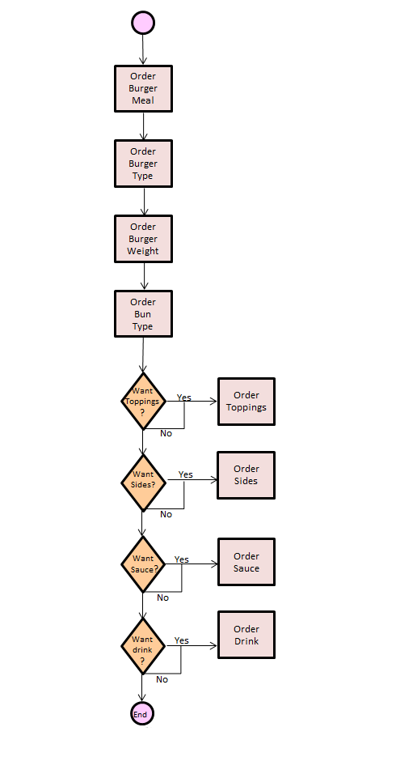

# API Guide for Burger Meal at GPM Diner

## Introduction
The General Putnam Motel Diner API allows you to order a burger meal special for lunch and request minor changes. The burger meal options and their related costs need to be outlined to the customer. The customer can order the burger meal special via the General Putnam Motel Diner’s order app. The customer is able to choose from a selection of buns, toppings, sides, and sauces. The guide needs to outline the default values for the different meal attributes and any additional cost that is beyond the standard burger meal special options. In order to use the API, the customer will need a current user name, password, and credit card associated with the account.

## Workflow
This workflow diagram is a flowchart that shows how Burger Meal order is processed on the GPMD API. Each part of the diagram visualizes possible choices of the burger meal and its following steps based on its preceeding choice. 

## References  
Special thanks to Alex Fiedler who created the [original General Putnam Motel Diner API Guide](https://www.linkedin.com/feed/update/urn:li:activity:6626465471241732096/) based on the movie, My Cousin Vinny.

## For additional information:  
* [Authentication](authentication.md) &mdash; reference for GPMD API Authentication. 
* [GET Request](get-request.md) &mdash; reference for GPMD GET Requests. 
* [POST Request](post-request.md) &mdash; reference for GPMD POST Requests. 

